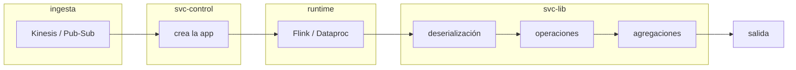

<!-- PLANTILLA. Va en svc-docs/architecture/flow.md.
     Este es el documento que hoy reconstruyes a greps cada vez que planificas.
     Se escribe una vez y se corrige cuando cambie. -->

# Flujo end-to-end

> Última revisión: <fecha> · commits: svc-control `<hash>`, svc-lib `<hash>`

<!-- Los hashes son lo que te dice si esto caducó. No los quites. -->

## Diagrama

## Paso a paso

| # | Qué pasa | Dónde | AWS | GCP |
|---|---|---|---|---|
| 1 | <ingesta> | `fichero:línea` | Kinesis | Pub/Sub |
| 2 | <creación de la app> | `fichero:línea` | | |
| 3 | <puntero al JAR> | `fichero:línea` | S3 | GCS |
| 4 | <deserialización> | `fichero:línea` | | |
| 5 | <operaciones> | `fichero:línea` | | |
| 6 | <salida> | `fichero:línea` | | |

## Dónde diverge AWS de GCP

<!-- Lo que impide aplicar el patrón de una nube en la otra. -->

## Lo que aún no está verificado

<!-- Honestidad explícita. Un documento con dudas marcadas es fiable;
     uno que finge estar completo, no. -->
